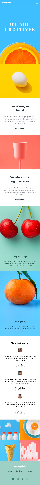

# Frontend Mentor - Sunnyside Agency Landing Page Solution

This is my solution to the [Sunnyside Agency Landing Page challenge on Frontend Mentor](https://www.frontendmentor.io/challenges/sunnyside-agency-landing-page-7yVs3B6ef). This project helped me improve my frontend development skills by building a responsive and interactive landing page using modern React technologies.

## Table of Contents

- [Overview](#overview)
  - [The Challenge](#the-challenge)
  - [Screenshot](#screenshot)
  - [Links](#links)
- [My Process](#my-process)
  - [Built With](#built-with)
  - [What I Learned](#what-i-learned)
  - [Continued Development](#continued-development)
  - [Useful Resources](#useful-resources)
- [Getting Started](#getting-started)
  - [Prerequisites](#prerequisites)
  - [Installation](#installation)
  - [Running the Project](#running-the-project)
- [Project Structure](#project-structure)
- [Author](#author)

## Overview

### The Challenge

Users should be able to:

- View the optimal layout for the site depending on their device's screen size
- See hover states for all interactive elements on the page
- Navigate through a responsive hamburger menu on mobile devices
- Experience smooth interactions and transitions

### Screenshot



### Links

- [Solution URL](https://github.com/ffozdemir/sunnyside-agency-landing-page)
- [Live Site URL](https://precious-biscochitos-1e8e40.netlify.app)

## My Process

### Built With

- **React 18** - Component-based UI library
- **Vite** - Fast build tool and development server
- **Modern JavaScript (ES6+)** - Arrow functions, destructuring, modules
- **React Hooks** - useState for state management
- **Semantic HTML5 markup** - Accessible and meaningful structure
- **CSS3** - Custom properties, Flexbox, CSS Grid
- **CSS Modules** - Component-scoped styling
- **Google Fonts** - Barlow and Fraunces font families
- **Responsive Design** - Mobile-first workflow
- **Picture Element** - Responsive images with srcset

### What I Learned

During this project, I significantly improved my React development skills:

**React Component Architecture:**
```jsx
// Component composition and reusability
const PictureComponent = ({ desktopImage, mobileImage, altText, pictureClass }) => {
  return (
    <picture>
      <source srcSet={desktopImage} media="(min-width: 48rem)" />
      
    </picture>
  );
};
```

**State Management with Hooks:**
```jsx
// Mobile menu toggle functionality
const [isMobileMenuOpen, setIsMobileMenuOpen] = useState(false);

const handleHamburger = () => {
  setIsMobileMenuOpen(!isMobileMenuOpen);
};
```

**CSS Custom Properties:**
```css
:root {
  --soft-red: hsl(7, 99%, 70%);
  --yellow: hsl(51, 100%, 49%);
  --font-family-primary: "Barlow", sans-serif;
  --font-family-fraunces: "Fraunces", serif;
}
```

### Continued Development

In future projects, I want to focus on:

- **Advanced React Patterns** - Context API, custom hooks, compound components 
- **Testing** - Jest, React Testing Library for component testing
- **Performance Optimization** - Code splitting, lazy loading, image optimization
- **Accessibility** - ARIA roles, keyboard navigation, screen reader support
- **Animation Libraries** - Framer Motion for smooth transitions

### Useful Resources

- [React Documentation](https://react.dev/) - Official React docs with hooks and modern patterns
- [Vite Documentation](https://vitejs.dev/) - Fast build tool for modern web projects
- [CSS Tricks - A Complete Guide to Grid](https://css-tricks.com/snippets/css/complete-guide-grid/) - Comprehensive CSS Grid reference
- [MDN Web Docs](https://developer.mozilla.org/) - Essential web development documentation
- [Frontend Mentor](https://www.frontendmentor.io/) - Practice projects for frontend development

## Getting Started

### Prerequisites

Make sure you have the following installed:
- **Node.js** (version 16 or higher)
- **npm** (usually comes with Node.js)

### Installation

1. Clone the repository:
```bash
git clone https://github.com/ffozdemir/sunnyside-agency-landing-page.git
```

2. Navigate to the project directory:
```bash
cd sunnyside-agency-landing-page
```

3. Install dependencies:
```bash
npm install
```

### Running the Project

1. Start the development server:
```bash
npm run dev
```

2. Open your browser and visit `http://localhost:5173`

3. For production build:
```bash
npm run build
```

4. Preview the production build:
```bash
npm run preview
```

## Project Structure

```
sunnyside-agency-landing-page/
├── public/
│   ├── _redirects          # Netlify SPA redirects
│   └── favicon.ico
├── src/
│   ├── assets/
│   │   └── images/         # All project images
│   │       ├── desktop/    # Desktop-specific images
│   │       ├── mobile/     # Mobile-specific images
│   │       └── *.svg       # Icons and logos
│   ├── components/
│   │   ├── Header/
│   │   │   ├── Header.jsx
│   │   │   ├── Header.css
│   │   │   ├── Nav.jsx
│   │   │   └── HeaderHero.jsx
│   │   ├── Main/
│   │   │   ├── Article/
│   │   │   │   ├── ArticleSection.jsx
│   │   │   │   ├── ArticleSection.css
│   │   │   │   └── PictureComponent.jsx
│   │   │   ├── Testimonial/
│   │   │   │   ├── TestimonialSection.jsx
│   │   │   │   ├── TestimonialSection.css
│   │   │   │   └── Profile.jsx
│   │   │   ├── GallerySection.jsx
│   │   │   └── GallerySection.css
│   │   ├── Footer/
│   │   │   ├── Footer.jsx
│   │   │   ├── Footer.css
│   │   │   └── FooterLogo.jsx
│   │   └── Nav/
│   │       └── NavLinks.jsx
│   ├── App.jsx             # Main App component
│   ├── main.jsx           # React entry point
│   └── global.css         # Global styles and CSS variables
├── index.html             # HTML template with Google Fonts
├── package.json           # Dependencies and scripts
├── vite.config.js         # Vite configuration
└── README.md             # Project documentation
```

## Author

- Frontend Mentor - [@ffozdemir](https://www.frontendmentor.io/profile/ffozdemir)
- GitHub - [@ffozdemir](https://github.com/ffozdemir)