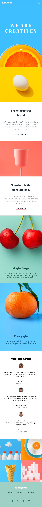

# Frontend Mentor - Sunnyside Agency Landing Page Solution

This is my solution to the [Sunnyside Agency Landing Page challenge on Frontend Mentor](https://www.frontendmentor.io/challenges/sunnyside-agency-landing-page-7yVs3B6ef). This project helped me improve my frontend development skills by building a responsive and interactive landing page.

## Table of Contents

- [Overview](#overview)
  - [The Challenge](#the-challenge)
  - [Screenshot](#screenshot)
  - [Links](#links)
- [My Process](#my-process)
  - [Built With](#built-with)
  - [What I Learned](#what-i-learned)
  - [Continued Development](#continued-development)
  - [Useful Resources](#useful-resources)
- [Author](#author)

## Overview

### The Challenge

Users should be able to:

- View the optimal layout for the site depending on their device's screen size.
- See hover states for all interactive elements on the page.

### Screenshot

### Links

- [Solution URL](https://github.com/ffozdemir/sunnyside-agency-landing-page)
- [Live Site URL](https://precious-biscochitos-1e8e40.netlify.app)

## My Process

### Built With

- Semantic HTML5 markup
- CSS custom properties
- Flexbox
- CSS Grid
- Mobile-first workflow

### What I Learned

During this project, I improved my understanding of responsive design and CSS Grid.

### Continued Development

In future projects, I want to focus on:

- Improving accessibility (ARIA roles, semantic HTML).
- Enhancing animations and transitions for better user experience.

### Useful Resources

- [CSS Tricks - A Complete Guide to Grid](https://css-tricks.com/snippets/css/complete-guide-grid/) - Helped me understand CSS Grid better.
- [MDN Web Docs](https://developer.mozilla.org/) - My go-to resource for HTML, CSS, and JavaScript documentation.

## Author

- Frontend Mentor - [@ffozdemir](https://www.frontendmentor.io/profile/ffozdemir)
- GitHub - [@ffozdemir](https://github.com/ffozdemir)

